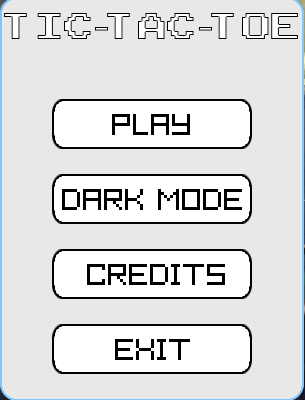

# Tic-Tac-Toe (OOP + Raylib)

A simple Tic-Tac-Toe game built using Object-Oriented Programming principles and rendered with the Raylib graphics library.

## 🎯 Objective

Showcase OOP concepts through a small but complete game implementation.

## 🛠️ Tech Stack

- **Language:** C++
- **Graphics:** Raylib
- **Paradigm:** Object-Oriented Programming

## ✨ Features

- 3×3 grid with basic UI
- Player vs Player gameplay
- Win/draw detection
- Visual mark placement (X/O)
- Clean class-based design

## 🧱 OOP Structure Overview

### `Game`

- Controls the main loop
- Manages turns, board state, win/draw checking
- Delegates rendering and input handling to other classes

### `Board`

- Stores the 3×3 grid
- Methods for placing marks, checking if a cell is empty, checking win states

### `Player`

- Represents each player (X or O)
- Handles input and communicates moves to `Game`

### `Renderer` (optional class if you implemented one)

- Handles drawing grid, marks, status text
- Keeps visual logic separate from game logic

## ▶️ How to Run

1. Compile:

   ```bash
   # Using MakeFile
   make
   ```

2. Run:
   ```bash
   make run
   ```

## 📷 Screenshots



## 🧪 Future Improvements (if teacher asks)

- AI opponent (minimax)
- Score tracking

## 📝 Notes

This project focuses on clean class design rather than graphics complexity. Raylib is used only for simple rendering and user interaction.
